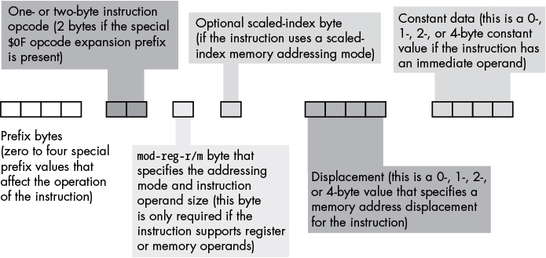

# Understanding the Machine

## Numeric Representation

- **positional notation**
- **radix**
- **radix point**

### Binary

- Two conventions to represent binary in assemblers:
  - **MASM**
    - `1001b` - `9`
  - **HLA**
    - `%11_1011_0010_1101`

### Hex

- prefix `0x`
- **MASM** uses `h`/`H` suffix
  - `0deadh` - `DEAD` base 16
- **HLA** uses prefix `$`
  - `$FDEC_A012`

### Octal

- in C, prefix `0`
  - `0123` - decimal `83` (64 + 2 \* 8 + 3)
- **MASM** uses suffix `Q`/`q`

### Numeric/String conversions

- expensive
- floating-point values are most complicated & difficult string <-> numeric

### Internal Numeric Representation

- **nibble** - collection of 4 bits
- **byte** - 8 bits
  - smallest addressable data item on many CPUs
- a **word** can have different definitions on different CPUs
  - 16/32/64 bits
  - LO byte and HO byte
- Intel 80x86 platforms support **tbyte** - 80-bit type
- **two's complement**
  - `-2^(n-1)` to `2^(n-1) - 1`
- **sign extension** & **sign contraction** operations
  - Assigning a smaller integer to a larger one may require _more_ machine instructions (longer to execute) than moving data between two like-sized variables

### Saturation

- **saturation**
  - reduce size of an integer value
  - loss of precision!
- by copying LO bits of the larger object into the smaller one

### Binary-Coded Decimal Representation

- BCD consists of a sequence of **nibbles**
- encodes decimal values using a binary representation
- COBOL
- For most calculations, binary is _more_ accurate
  - although for _certain_ calculations, BCD can be more accurate

### Fixed-Point Representation

- format: `101.01` - `5.25`
- **FPU** - floating-point unit
- more cost-effective to use CPU's native floating-point format
- can _only_ represent a small subset of the real numbers

### Scaled Numeric Formats

- efficient

## BINARY ARITHMETIC AND BIT OPERATIONS

- `isOdd = (ValueToTest & 1) != 0`
- `isDivisibleBy16 = (ValueToTest & 0xf) == 0`
  - check if the LO 4 bits are all `0`s
- **modulo-n counter**
  - in C/C++: `cntr = (cntr + 1) % n`
  - however, division is _expensive_ - requiring far more time to execute than addition
  - a more efficient version:
    ```c
    cntr += 1;
    if (cntr >= n) cntr = 0;
    ```
  - bit **AND** is _much faster_ than division
  - on most CPUs, using AND operator is quite a bit faster than using `if`
  - a more efficient version for n = 32:
  ```c
  cntr = (cntr + 1) & 0x1f // AND with value 2^m - 1
  ```
  - assembly:
  ```assembly
  inc(eax);
  and($1f, eax);
  ```
- **arithmetic shift right**
  - to divide a _signed_ number by 2
  - the HO bit does _not_ change
- _rare_ for a high-level language to support both
  - logical shift right, and
  - arithmetic shift right
- How to simulate a 32-bit logical shift right _and_ arithmetic shift right, when the language does _NOT_ guarantee the type of shift used

  ```c
  // assuming 32-bit integers
  // logical shift right:
  bit30 = ((value_to_be_shifted & 0x80000000) != 0) ? 0x40000000 : 0;
  // shift bits 0..30
  value_to_be_shifted = (value_to_be_shifted & 0x7fffffff) >> 1;
  // merge in bit #30
  value_to_be_shifted = value_to_be_shifted | bit30;

  // arithmetic shift right:
  bit3031 = ((value_to_be_shifted & 0x80000000) != 0) ? 0xc0000000 : 0;
  // shift bits 0..30
  value_to_be_shifted = (value_to_be_shifted & 0x7fffffff) >> 1;
  // merge in bit #30 and #31
  value_to_be_shifted = value_to_be_shifted | bit3031;
  ```

- Built-in support for packed data in C:
  ```c
  // the :n specifies the minimum number of bits allocated by compiler
  struct {
  unsigned bits0_3 :4;
  unsigned bits4_11 :8;
  unsigned bits12_15 :4;
  unsigned bits16_23 :8;
  unsigned bits24_31 :8;
  } packed_data;
  ```
  - this ^^^ are almost guaranteed to be _nonportable_
  - Fields that begin at position 0 in a packed data object can be accessed most efficiently
    - arrange the fields in packed data type such that the field accessed the most begins at 0
- in HLA/x86 assembly, data can be accessed at any arbitrary **byte boundary** in memory
  - `movzx((type byte packed_value), eax);`
  - `movzx` - move with zero extension

## Floating-Point Representation

- most floating-point formats use some number of bits to represent
  - a **mantissa**, and
  - a smaller number of bits to represent an exponent
- **mantissa** - a base value
  - usually falls within a limited range
- **exponent** - a multiplier
  - applied to mantissa, producing values outside of the range
- **The order of evaluation can affect the accuracy of the result.**
- **When performing a chain of calculations involving addition, subtraction, multiplication, and division, perform the multiplication and division operations first.**
- **When multiplying and dividing sets of numbers, try to multiply and divide numbers that have the same relative magnitudes.**
- You should _NEVER_ compare two floating-point values to see if they are equal
  - use `if (abs(value1 - value2) <= error)`
- the **miserly approach** vs. **eager approach**
  - **miserly approach**
    - compare whether two values are equal - within error tolerance
    - if not equal, compare to see if one is less than (or greater than) the other
  - **eager approach**
    - make the result of the comparison `true` as often as possible
    ```
    if (A < (B + error)) then Eager_A_lessthan_B;
    if (A > (B - error)) then Eager_A_greaterthan_B;
    ```
- the **KCS Floating-Point Standard**
  - single precision
    - 24-bit mantissa
    - 8-bit exponent
    - one's complement
  - double precision
    - 53-bit mantissa
    - 11-bit excess-1023 exponent
  - extended precision
    - uses 80 bits
    - 64-bit mantissa
    - 15-bit excess-16383 exponent
- on 80x86 FPUs, _all_ computations use extended-precision form
- **normalized** vs. **denormalized** values
  - a floating-point computation will be more accurate if it involves _only_ normalized values
  - because the mantissa has that many fewer bits of precision available for computation if HO bits of the mantissa are all `0`
- **guard bits** - maintain the extra precision
- **rounding** - facilitated by guard bits
  - truncation
    - standard for coercing floating-point value to integer
  - rounding up
  - rounding down
  - rounding to nearest
- **SNaN** vs. **QNaN** values
  - if the exponent contains _all_ `1`s, and
  - the mantissa is non-zero (discounting the implied bit)
  - then HO bit of mantissa (discounting the implied bit) determines whether the value represents a **quiet non-a-number** (QNaN) or **signaling not-a-number** (SNaN)
  - **QNaN** - indeterminate results
  - **SNaN** - invalid operation
- **+infinity**/**-infinity**
  - when exponent has all `1`s and mantissa has all `0`s
- `-0`/`+0` - if exponent bits are all `0`
  - indicated by sign bit
  - Intel recommends using the sign bit to indicate `0` was produced via:
    - underflow of a negative value (with sign bit set), or
    - underflow of positive value (sign bit clear)

### Floating-Point Operations

#### Addition/Subtraction

- Use 32-bit `unsigned` integer type to hold the bit representation for floating-poing values
- To ask C/C++ compiler to treat the bit pattern it finds in the `uint32_t` as a `float` without doing any conversion:
  ```c
  typedef uint32_t real;
  #define asreal(x) (*((float *) &x))
  ```
- addition and subtraction
  ```c
  void fpadd(real left, real right, real* dest);
  void fpsub(real left, real right, real* dest);
  ```
- subtraction
  ```c
  void fpsub(real left, real right, real* dest) {
    right = right ^ 0x80000000; // invert sign bit of the right operand
    fpadd(left, right, dest);
  }
  ```
- Unpack the sign
  ```c
  inline int extract_sign(real from) {
    return (from >> 31);
    // a possibly more efficient way:
    // return (from & 0x80000000) != 0;
  }
  ```
- Extract exponent
  ```c
  inline int extract_exponent(real from) {
    return ((from >> 23) & 0xff) - 127;
  }
  ```
- Extract mantissa
  ```c
  inline int extract_mantissa(real from) {
    if ((from & 0x7fffffff) == 0) return 0;
    // mask out the exponent and sign bits
    // then insert the implied HO bit of 1
    return ((from & 0x7FFFFF) | 0x800000);
  }
  ```
- _Shifting mantissa bits to the right -> reduce the precision of the number_
  - so we should _NOT_ truncate the bits we shift out of mantissa
  - instead, we should round the result to the nearest value we can represent with remaining mantissa bits
- IEEE shifting & rounding rules:
  - truncate the result if the last bit shifted out was a `0`
  - increment the mantissa by `1` if
    - the last bit shifted out was a `1`, and
    - there was at least one bit set to `1` in all other bits shifted out
  - if the last bit shifted out was a `1`, and all other bits (shifted out) were `0`s,
    - then round the resulting mantissa up by `1` if the mantissa's LO bit contains a `1`
- Shifting and rounding

  ```c
  void shift_and_round(uint32_t* val_to_shift, int bits_to_shift) {
    // to mask out bits to check for "sticky" bits
    static unsigned masks[24] = {
      0, 1, 3, 7, 0xf, 0x1f, 0x3f, 0x7f,
      0xff, 0x1ff, 0x3ff, 0x7ff, 0xfff, 0x1fff, 0x3fff, 0x7fff,
      0xffff, 0x1ffff, 0x3ffff, 0x7ffff, 0xfffff, 0x1fffff, 0x3fffff, 0x7fffff
    };

    static unsigned HO_masks[24] = {
      0, 1, 2, 4, 0x8, 0x10, 0x20, 0x40, 0x80,
      0x100, 0x200, 0x400, 0x800, 0x1000, 0x2000, 0x4000, 0x8000,
      0x10000, 0x20000, 0x40000, 0x80000, 0x100000, 0x200000, 0x400000,
    };

    // holds the value that will be shifted out of mantissa during
    // denormalization
    int shifted_out;

    assert(bits_to_shift <= 23);
    shifted_out = *val_to_shift & masks[bits_to_shift];
    *val_to_shift = *val_to_shift >> bits_to_shift;

    if (shifted_out > HO_masks[bits_to_shift]) {
      // if bits shifted out are greater than 1/2 of the LO bit, then
      // round the value up by 1
      // rule applied:
      // increment the mantissa by `1` if
      //   the last bit shifted out was a `1`, and
      //   there was at least one bit set to `1` in all other bits shifted out
      *val_to_shift = *val_to_shift + 1;
    } else if (shifted_out == HO_masks[bits_to_shift]) {
      // if exactly 1/2 of LO bit's value,
      // round the value to the nearest number whose LO bit is 0
      // rule applied:
      // if the last bit shifted out was a `1`, and all other bits (shifted out) were `0`s,
      //   then round the resulting mantissa up by `1` if the mantissa's LO bit contains a `1`
      *val_to_shift = *val_to_shift + (*val_to_shift & 1);
    }
  }
  ```

- Pack the results

  ```c
  inline real pack_fp(int sign, int exponent, int mantissa) {
    return (real)(
      (sign << 31)
      | ((exponent + 127) << 23)
      | (mantissa & 0x7fffff)
    );
  }
  ```

- `fpadd`

  ```c
  void fpadd(real left, real right, real* dest) {
    int l_exponent;
    uint32_t l_mantissa;
    int l_sign;

    int r_exponent;
    uint32_t r_mantissa;
    int r_sign;

    l_exponent = extract_exponent(left);
    l_mantissa = extract_mantissa(left);
    l_sign = extract_sign(left);

    r_exponent = extract_exponent(right);
    r_mantissa = extract_mantissa(right);
    r_sign = extract_sign(right);

    // special operands (infinity and NaNs)
    if (l_exponent == 127) {
      if (l_mantissa == 0) {
        // depends on value of the right operand
        if (r_exponent == 127) {
          // either:
          //   - infinity (zero mantissa)
          //   - QNaN (mantissa = 0x80000000)
          //   - SNaN (non-zero mantissa not equal to 0x80000000)
          if (r_mantissa == 0) {
            // infinity + infinity = infinity
            // -infinity - infinity = -infinity
            // -infinity + infinity = NaN
            // infinity - infinity = NaN
            if (l_sign == r_sign) {
              *dest = right;
            } else {
              *dest = 0x6fC00000; // +QNaN
            }
          } else {
            // NaN
            *dest = right;
          }
        }
      } else {
        // l_mantissa non-zero; l_exponent all 1s
        *dest = left;
      }
      return;
    } else if (r_exponent == 127) {
      // right is either NaN or +infinity/-infinity
      *dest = right;
      return;
    }

    // now we have two actual floating point values
    d_exponent = r_exponent;
    if (r_exponent > l_exponent) {
      shift_and_round(&l_mantissa, (r_exponent - l_exponent));
    } else if (r_exponent < l_exponent) {
      shift_and_round(&r_mantissa, (l_exponent - r_exponent));
      d_exponent = l_exponent;
    }

    if (r_sign ^ l_sign) {
      // signs are _different_
      if (l_mantissa > r_mantissa) {
        d_mantissa = l_mantissa - r_mantissa;
        d_sign = l_sign;
      } else {
        d_mantissa = r_mantissa - l_mantissa;
        d_sign = r_sign;
      }
    } else {
      // signs are same
      d_sign = l_sign;
      d_mantissa = l_mantissa + r_mantissa;
    }

    // normalize the result
    // note that *overflow* can happen
    if (d_mantissa >= 0x1000000) {
      shift_and_round(&d_mantissa, 1);
      ++d_exponent;
    } else {
      if (d_mantissa != 0) {
        while ((d_mantissa < 0x800000) && (d_exponent > -127)) {
          d_mantissa = d_mantissa << 1;
          --d_exponent;
        }
      } else {
        d_sign = 0;
        d_exponent = 0;
      }
    }

    *dest = pack_fp(d_sign, d_exponent, d_mantissa);
  }
  ```

## Character Representation

- **ASCII**
  - divided into 4 groups of 32 characters
  - first group: `$0` - `$1F`
    - **control characters**
  - second group: punctuations, special characters, numeric digits, etc
    - `$20` - space
  - third group: upper case letters
  - fourth group: lower case letters
- The uppercase symbol differs from its lowercase equivalent in exactly one bit position
  - bit 5
- To quickly convert an _alphabetic character_ between upper- and lower- case, invert bit 5
- Bit 5 _and_ 6 determine the character's group
  - convert any upper- or lower- case (or special) character to its corresponding control character by setting bits 5 and 6 to `0`

```
--------------------------------------
Bit 6 | Bit 5 | Group
--------------------------------------
0     | 0     | Control characters
--------------------------------------
0     | 1     | Digits and punctuation
--------------------------------------
1     | 0     | Uppercase and special
--------------------------------------
1     | 1     | Lowercase and special
```

- **double-byte character sets** (DBCS)
  - supports up to 1021 different characters
  - 3 \* 256 + (256 - 3) = 1021
- Unicode
  - `U+0041` - letter `A`
  - **Basic Multilingual Plane (BMP)** - `U+000000` - `U+00FFFF`
  - **code point**
  - **surrogates**
- **grapheme cluster**
  - a sequence of one or more Unicode code points that combine to form a single language element (a single character)
- **zero-terminated strings** vs. **length-prefixed strings**
- Types of strings
  - **static**
    - can be determined at compile time
  - **pseudo-dynamic**
  - **dynamic**

## Memory Organization and Access

### Basic System Components

- **von Neumann Architecture**
  - CPU
  - memory
  - I/O
- the **System Bus**
  - most CPUs have 3 major buses
    - **data**
    - **address**
    - **control**
- Data bus
  - 32-bit wide
  - 64-bit wide
  - even 128-bit
  - processor size (8-, 16-, 32-, or 64- bit) - determined by whichever value is smaller:
    - number of data lines on the process, or
    - size of the largest general-purpose integer register
- Address Bus
  - determines which address (memory location or I/O device) needs to talk to CPU
  - number of bits on the address bus => _max_ number of addressable memory and I/O locations
  - newer CPUs contain specialized buses intended to talk to very specific **dynamic random-access memory** (**DRAM**) modules
  - memory control unit directly built into the CPU
  - max DRAM can be connected to a CPU is a function of the memory control unit in CPU
    - rather than the size of external address bus
  - some older laptops have 16MB/32MB max memory limitation though 64-bit CPUs
- Control Bus
  - an electric collection of signals that control how processor communicates with rest of the system
  - read or write?
  - e.g. system uses 2 lines on the control bus, **read** and **write**, to determine data flow direction (CPU -> memory or memory -> CPU)
  - composition:
    - **system clock** lines
    - **interrupt** lines
    - **status** lines
    - **byte enable** lines
      - on some CPUs that supports **byte-addressable memory**
      - allow 16-, 32-, and 64- bit processors to deal with smaller chunks of data
      - by communicating the size of the accompanying data
    - a signal, on x86 CPUs, that helps distinguish between address spaces
      - 80x86 arch (unlike many other processors) provides 2 _distinct_ address spaces
        - memory
        - I/O
      - but only one physical address bus - shared between I/O and memory
      - to decide which component the address is intended for
      - when signals are active, I/O devices use address on the LO 16 bits of address bus
      - when signals inactive, I/O devices ignore them & memory subsystem takes over

### Physical Organization of Memory

- CPU addresses a max `2^n` different memory locations, where
  - `n` is number of bits on address bus
  - although most x86 CPUs do not actually have max addressable amount of memory
- 80x86 CPUs support **byte-addressable memory**
- To assign `0` to memory location `125`:
  - CPU places `0` on data bus
  - CPU places `125` on address bus
  - CPU asserts the write line on the control bus
- To read value of location `125` in memory, the CPU:
  - places `125` on address bus
  - asserts read line on control bus
  - reads resulting data from data bus
- 16-bit data buses
  - organize memory into **banks** - even & odd
  - data bus lines D0 - D7 transfer the LO byte of the word - always even address
  - data bus lines D8 - D15 transfer the HO byte of the word - always odd address
  - word has 16 bytes
  - the 16-bit 80x86 CPUs _always_ place _even_ addresses on the **address bus**
  - accessing a word at an _odd_ address requires 2 memory operations
  - _accessing words at odd addresses on a 16-bit processor is slower than accessing words at even addresses_
- 32-bit data buses
  - can access any single byte with one memory operation
  - address placed on the **address bus** is _always_ multiples of 4
- Proper data alignment:
  - the LO byte of word values should _always_ be placed at even addresses
  - LO byte of double-word values should always be placed at addresses evenly divisible by 4
- 64-bit data buses
  - CPUs with 64-bit data buses have special cache memory reducing impact of nonaligned data access

### Big-Endian vs. Little-Endian

- **little-endian**
  - LO byte has the lowest address in memory
  - USB
  - x86 Unix
- **big-endian**
  - HO byte has the lowest address in memory
  - TCP/IP
- **mirror-image swap** - to convert little <-> big endian
- **discriminant union**

### System Clock

- the **system clock**
  - an electric signal on the **control bus** that alternates between `0` and `1` periodically
    - the rate - **system clock frequency**
      - several _billion_ cycles per second
    - **clock period**/**clock cycle** - time it takes to switch `0` -> `1` or `1` -> `0`
  - _all_ activity within the CPU is synchronized with the edges (rising/falling) of the clock signal
  - the timing standard within the system
  - system clock spends most of time at either `0` or `1`
    - very little time switching between
- **memory access** is synch'ed with system clock
  - memory access occurs no more than once every clock cycle
  - **memory access time** - number of clock cycles between a memory request (read/write) and when the memory operation completes
- modern CPUs are _much faster than_ memory devices
  - they often have a second clock, the **bus clock**
  - some fraction of the CPU speed
- typical 80x86 CPUs have a one-cycle memory access time
- the CPU does _NOT_ wait for memory
  - **access time** is specified by **bus clock frequency**
- **wait states**
  - an extra clock cycle that gives a device additional time to respond to CPU
  - in reality, additional decoding/buffering logic between CPU and memory
  - almost every CPU provides a pin (signal appearing on control bus) allowing you to insert wait states
  - but because of **cache memory** - zero wait times most of the time could be achieved
- **cache memory**
  - a small amount of _very fast_ memory that sits between CPU and main memory
  - bytes within a cache do _NOT_ have fixed addresses
  - can dynamically reassign addresses
- caching memory locations _while accessing them_ will _NOT_ speed up the program if constantly accessing consecutive locations never accessed before
  - when a cache miss occurs, most caching systems will read several consecutive bytes of main memory (**cache line**)
- **Two-level (L2) caching system**
  - first level is on chip (8192-byte)
  - L2 is between CPU and main memory
  - L2 and L1 are in same packaging on newer CPUs
  - generally does _NOT_ operate on zero wait states
- **Three-level (L3) cache**
  - can be quite large

### CPU Memory Access

- Three different ways:
  - **direct**
  - **indirect**
  - **indexed**
- RISC processors _rarely_ access memory as frequently as 80x86
- **Direct Memory Addressing Mode**
  - generally used for accessing global static variables
  - encodes a variable's memory address as part of actual machine instruction
- **Indirect Addressing Mode**
  - uses a register to hold a memory address
  - used for accessing objects referenced by a pointer variable
- **Indexed Addressing Mode**
  - the machine instructions encode both an **offset** (direct address) and a **register** in the bits
  - at runtime, CPU computes the sum of these 2 address components to create an **effective address**
  - great for accessing
    - array elements
    - structures
    - records
- **Scaled-Index Addressing Mode**
  - uses 2 registers, plus an offset

## Composite Data Types and Memory Objects

### Pointer

- an pointer is actually an abstraction of a memory address
- some languages (e.g. LISP) implement pointers by using **double indirection**
  - the pointer object contains the address of some memory variable whose value is the address of the object to be accessed
- objects allocated on **heap** - **anonymous variables**
  - referred to by address

### Array

- multi-dimensional array
  - **row-major ordering**
  - **column-major ordering**

### Record/Structure

- most compilers ensure the length of entire record is a multiple of 2, 4, 8, or 16 bytes
  - append padding bytes to fill out the record's size

### Class

- **VMT** - **virtual method table**
  - a pointer to an array of pointers to methods associated with the class
  - when a program calls one of the virtual methods in the class:
    - it fetches address of the VMT from the object in memory
    - uses the pointer to fetch the specific method address
    - then uses the fetched address to call the method directly
- there is a single VMT associated with each class in a program
  - even when classes inherit fields from some base class, their VMT (generally) differs from the base class's VMT

#### Constructors

- Before you can actually call any methods in a VMT, you have to make sure:
  - the table is actually present in memory (holding addresses of the methods defined in class)
  - to initialize the VMT pointer field in every class created
- In C/C++, compiler automatically generates the VMTs when compiling the _class definitions_
- Initialization of the VMT pointer field in the object itself is (usually) handled by **default constructor**

#### Classes in C++

- allow **multiple inheritance**

## Boolean Logic and Digital Design

- `A'` - NOT `A`
- `A • B` - A AND B
- `A + B` - A OR B
- the **canonical form** of _any_ boolean function:
  - use a sum (logical OR) of minterms
- **minterm** - a product containing exactly n literals, where n is number of input variables
  - eg. minterms for 3 variables A, B, and C:
    - A'B'C'
    - AB'C'
    - A'BC'
    - ABC'
    - A'B'C
    - AB'C
    - A'BC
    - ABC
- **NAND** gate
  - NOT AND
  - from transistor/hardware perspective, NAND gate is simpler to construct than AND gate
- CPU is built from **combinational circuits**
  - systems containing basic Boolean operations (AND, OR, NOT), some inputs, and a set of outputs
  - each output represents a _different_ boolean function
- Memory modules have **chip-select lines**
  - with a two-input, four-output decoder
  - specifying the HO 2 bits of the memory address

## CPU Architecture

### Basic CPU design

- the capability of **rewire**
  - **patch board**
- **stored program computer**
  - **control unit (CU)**
    - uses **instruction pointer** to hold address of an instruction's binary numeric code (a.k.a. **opcode**)
    - fetches opcode from memory
    - places opcode in the instruction decoding register - for execution
    - then increments the instruction pointer
- CPU uses 2 common approaches to execute the instruction fetched by **control unit**
  - **random logic** (hardwired)
  - **microcode** (emulation)
- **microcode**
  - contains a small, very fast **execution unit**, a.k.a. **microengine**
    - which, uses the binary opcode to select a set of instructions from the microcode bank
  - executes one microinstruction per clock cycle
  - must fetch its instructions from the microcode ROM (read-only memory)
    - performance bottleneck
- **random logic**
  - _not necessarily_ faster than microcode
  - often includes a sequencer
    - steps through several states (one state per clock cycle)
- whether **microcode** or **random logic** is better depends on memory technology

### Executing Instructions, Step by Step

- `loop` - a **CISC (complex instruction set computer)** instruction
  - subtracts `1` from `ECX`
  - does a conditional jump if `ECX` does not contain `0`
  ```asm
  sub(1, ecx); // on x86 the sub instruction sets the zero flag
  jnz SomeLabel;
  ```
- one clock cycle per operation (or stage) that CPU executes
- A possible sequence:
  1. Fetch the instruction's opcode from memory
  2. Update EIP (**extended instruction pointer**) register with address of the byte following the opcode
  3. Decode the instruction's opcode
- `add`
  - **ALU (arithmetic logical unit)**
- the **flags register**, a.k.a. **condition-codes register** or **program-status word**
  - an array of Boolean variables in CPU
  - tracks whether the previous instruction produced
    - an overflow, or
    - a zero result, or
    - a negative result, or
    - other conditions

### RISC vs CISC

- **CISC** - **complex instruction set computer**
- **RISC** - **reduced instruction set computer**

### Parallelism

- in reality, even if a RISC instruction is simplified, its actual execution still requires multiple steps
- goal: execute _one_ instruction per clock cycle, on average
  - via **parallelism**
- CPU has only one data bus - it _cannot_ fetch an instruction's opcode while trying to store data to memory
- **functional unit** - group of logic that performs a common operation
  - a functional unit can do only one operation at a time
- 32-bit data bus is able to fetch 4 bytes in a single bus cycle
- **prefetch queue**
  - hardware
  - can generally hold between 8 and 32 bytes
- **Bus Interface Unit (BIU)**
  - controls access to address & data buses
  - can fetch additional bytes from memory that holds machine instructions and store them in prefetch queue
- CPU _cannot_ overlap the process of fetching and decoding opcode for the next instruction with the process of executing a jump instruction that transfers control
  - avoid jumping around in the program as much as possible - if you want fast code
- What factors can hurt performance of prefetch queue?
  - jumps that actually transfer control
  - instruction size
    - instructions involving constants and memory operands tend to be the largest
  - data bus width
    - instructions that access memory compete with the prefetch queue for access to the bus
- **pipelining**
- **bus contention** - competition between instructions for access to the bus
  - whenever an instruction needs to access an item in memory
  - could be handled by **pipeline stall**
    - CPU gives priority to instruction farthest along the pipeline
- **instruction caches** - providing multiple paths to memory
  - separate from data cache
  - used for machine instructions
- **Harvard Architecture**
  - CPU has 2 separate memory spaces
    - one for instructions
    - one for data
  - no contention for the bus
  - BIU continues to fetch opcodes on the instruction bus while accessing memory on data/memory bus
- Advanced CPUs use an _internal_ **Harvard Architecture** and an _external_ **von Neumann architecture**
  - separate on-chip caches for data and instructions
  - each path between section within CPU represents an _independent_ bus
  - data can flow on _all_ paths concurrently
- On-chip, L1 instruction caches are generally quite small - 4Kb to 64Kb
  - shorter the instruction, the more will fit in the cache
  - more instructions in the cache, the less often bus contention will occur
- **Hazards** - 2 types
  - **control hazards**
    - when CPU branches to some new location in memory
    - consequently has to flush (from the pipeline) the instructions that are in various stages of execution
  - **data hazards**
    - when 2 instructions attempt to access the same memory location out of sequence
    - happens when the source operand of one instruction is a destination operand of a previous instruction
    - e.g.
      ```asm
      mov(some_var, ebx);
      mov([ebx], eax);
      ```
      - stall the pipeline to synch the 2 instructions
      - 2 cycles delayed
    - reduced by simply rearranging the instructions
- CISC (80x86) processors handle **control hazards** _automatically_
- **Superscalar Operation** - executing instructions in parallel
  - _can_ execute more than one instruction per single clock cycle
  - supported 80x86
  - a single instruction is _NOT_ a single operation
- **superscalar CPU** has several **execution units**
  - _Use short instructions_
- **out-of-order execution**
  - CPU can execute instructions prior to the completion of instructions appearing previously in the code stream
- **register renaming**
  - gives CPU more registers than it actually has
  - used to prevent hazards
  - CPU could support an array of EAX registers
    - `eax[0]`, `eax[1]`, etc
    - not selectable for programmers though
- **VLIW Architecture**
  - **very long instruction words**
  - CPU fetches a large block of bytes (41 bits)
  - CPU can execute 3 or more instructions per clock cycle
- **Parallel Processing**
  - common CPUs use **single instruction, single data (SISD)** model
    - executes one instruction at a time, operating on a single piece of data
  - Two common parallel models:
    - **single instruction, multiple data (SIMD)**
    - **multiple instruction, multiple data (MIMD)**
      - **multiprocessor system**
- **Multiprocessing**
  - **cache coherency problem**
  - **hyperthreading**

## Instruction Set Architecture

### Basic Design Goals

- `loop` & `enter` instructions on 80x86 see _very little_ usages in modern high-performance programs
- In typical CPU, computer encodes instructions as numeric values (**opcodes**) and stores them in memory
- instructions must each have a unique code
- with an n-bit number, 2^n different possible opcodes
- to encode m instructions, need at least log(m) bits
- with a 7-bit opcode, there are 128 different instructions
  - to decode each of 128 instructions, need a 7-to-128-line decoder
  - expensive!
- A single large decoder can often be replaced by several smaller, less expensive ones
- CPU designers could encode instructions like `mov` with a **subopcode**
  - then encode the instruction's operands using other bit fields
  - e.g. `mov(eax, ebx)` & `mov(ecx, edx)`
- Goal of instruction set design: **opcodes should be easy to decode**
- CPU designer's goal: assign an appropriate number of bits to
  - the opcode's instruction field, and
  - to its operation fields
- Whether CPUs capable of reading _bytes_ from memory?
  - most RISC CPUs read memory _only_ in 32- or 64- bit chunks
  - opcode will be same size as smallest object the CPU can read from memory at one time
- operands?
  - include all operands in opcode, or
  - do _not_ count operands like immediate constants or address displacements as part of opcode
- Variable-length instructions
  - CPU must first decode the instruction's size (1-byte, 2-byte, etc)
  - introduces delays in the decoding steps
  - limits CPU's max clock speed (reducing CPU's clock frequency)
- Choosing Instructions
  - Do _not_ use up the opcodes as quickly as possible
  - produce a consistent and complete instruction set give the design compromises
- To encode the (groups of) instructions
  - use some bits to select the group
  - use some bits to select a particular instruction from that group
  - use some bits to encode the operand types (registers, memory location, constants)

### Encoding 80x86 Instructions



## Memory Architecture And Organization

- As a memory device gets larger, it tends to be slower
- Registers are the _fastest_
- The **main memory** subsystem - compared to registers, L1 cache, L2 cache, etc
  - typically DRAM
  - SDRAM (synchronous DRAM)
  - double data rate DRAM (DDRAM)
  - DDR3
  - DDR4
- **NUMA** - **non-uniform memory access**
  - slower access times
  - in graphics cards
  - in flash memory devices
- Programs explicitly control access to registers, main memory, and those memory hierarchy subsystems _only_ at file storage level and below
- modern DRAM main-memory subsystems are much slower than CPU
- It's the **virtual memory** subsystem's responsibility to move often requested data from hard disk to main memory
  - if even faster access needed, caching system will move data from main memory to cache

```txt
CPU <-> L1 cache <-> L2 <-> L3 <-> Main Memory <-> Virtual Memory
```

- The largest percentage of memory accesses takes place in L1 cache subsystem
- L2 cache can be as much as _one order of magnitude_ slower than L1 cache

### Cache Architecture

- cache memory is _not_ organized in a single group of bytes
  - organized in blocks of **cache lines**
  - each line contains (16/32/64/etc) bytes
  - each line can have different _noncontiguous_ addresses

#### Direct-Mapped Cache

- a.k.a. **one-way associative cache**
- particular block of main memory is _always_ loaded into (mapped to) the exact same cache line
  - determined by small number of bits in data block's memory address
- _inefficient_
- BUT very effective for data accessed _sequentially_ rather than _randomly_
- instruction bytes (executed by CPU) can be stored effectively in a direct-mapped cache

#### n-Way Set Associative Cache

- cache broken up into sets of `n` cache lines
- twoway- or four-way set associative cache
  - by programs
- many CPU designers use separate caches for data & machine instruction bytes
  - e.g. 8kb data cache & 8kb instruction cache

#### Cache-Line Replacement Policies

- LRU
- FIFO
- random

#### Cache Write Policies

- _ANY_ data written to cache must ultimately be written to main memory as well
- Two common write policies:
  - **write-through**
  - **write-back**
- **write-through**
  - better policy when two different CPUs are communicating through shared memory
- **write-back**
  - higher performance
  - **dirty bit**

#### How to use cache

- Exhibit either spatial or temporal locality of reference
  - place often used variables adjacent in memory so they _tend to_ fall into the same cache lines
  - avoid data structures & access patterns that force cache to frequently replace cache lines
- **thrashing**

### NUMA and Peripheral Devices

- typical video card interfaces with CPU through **peripheral component interconnect express (PCI-e)** bus

### Virtual Memory, Memory Protection, Paging

- virtual memory on 80x86 CPUs gives each process its own 32-bit address space
- **paging**
  - provides mechanism whereby OS can move infrequently used pages to secondary storage
- **translation lookaside buffer (TLB)**
  - to prevent cluttering data/instruction cache with page-table entries
  - page table's own cache
  - typically 64 - 512 entries on modern Intel

### How to write software what is cognizant of memory hierarchy

- **Declare together all variables you use within a common code sequence**
  - storage will be allocated in physically adjacent memory locations
- **Use local (automatic) variables**
  - local storage allocated on stack
  - system references stack frequently
  - variables on stack tend to be in cache
- **Declare scalar variables together - separately from array/record variables**
  - access to any of several adjacent scalar variables generally forces system to load _all_ adjacent objects into cache

### Runtime Memory Organization

- different types of data in different sections/segments of main memory

```
               ________________________________________
High addresses | Storage (uninitialized) variables    |
               ----------------------------------------
               | Static variables                     |
               ----------------------------------------
               | Read-only data                       |
               ----------------------------------------
               | Constants (not user accessible)      |
               ----------------------------------------
               | Code (program instructions)          |
               ----------------------------------------
               | Heap                                 |
               ----------------------------------------
               | Stack                                |
               ----------------------------------------
       Adrs $0 | Reserved by OS (typically 128KB)     |
               ----------------------------------------
```

- OS reserves the lowest memory address
  - help detect `NULL` pointer references
  - **general protection fault**
- **binding** - process of associating an attribute with an object
- **scope**
  - qualified as static attribute in compiled languages
- **dynamic** - objects assigned with some attribute during program execution

#### Code, Read-Only, and Constant Sections

- the **code** section - program's machine instructions
- the **constant** section - compiler-generated read-only data
- the **read-only** data section - user-defined but read-only data

#### Static variables section

- **static** objects
  - attribute bound to them _prior to_ the application's execution
    - during compilation/linking
  - constants
  - global (program-level) variables
- **static** section - user-defined, initialized, static variables
- **static** variables
  - compiler places the initial values in the executable file
  - when app is executed, OS loads this portion of executable file (containing static variables) into memory

#### Storage Variables Section

- **storage** (a.k.a. BSS) - user-defined, _uninitialized_ variables
- compilers put static objects that do _not_ have explicit values associated with them
  - simply telling OS how many bytes to set aside for that section
- This section in the executable file does _NOT_ actually contain any data
- programs that declare uninitialized static objects (especially _large arrays_) in a BSS section will consume _less_ disk space

#### Stack

- **activation record**
  - a special data structure
  - created by system when a subroutine first begins execution
  - deallocated when subroutine returns to its caller
- implemented by using a register **stack pointer**
- some CPUs do _not_ provide explicit stack pointer
- if stack pointer provided - **hardware stack**
  - 80x86
  - data on stack can be manipulated by fewer instructions
- if not, **software-implemented stack**
  - MIPS Rx000 CPU

#### Heap & Dynamic Memory Allocation

- **heap** - dynamic variables
- _NEVER_ part of the executable file

##### Garbage Collection

- overhead required
- **first-fit search** vs. **best-fit search**
- when heap manager satisfies a memory allocation request, it usually creates _two_ blocks of memory
  - one in use
  - one remaining

##### OS & Memory Allocation

- OS API calls are often very slow
  - because they generally involve switching between kernel mode and user mode on CPU

##### Heap Memory Overhead

- Two types of overhead
  - performance (speed)
  - memory (space)
- heap manager will allocate bytes of storage so that the complete allocation is an _even_ multiple of the granularity value
- **Application should never assume it has more memory available than it requests**
- a typical memory request may require between 4 and 16 bytes, plus what application requests
- the larger the application request, the less impact the control information & **internal fragmentation** will have on heap

## Input and Output

- to send data to output device, CPU moves data to a special memory location
- to read data from in input device, CPU retrieves data from the device's address
- I/O ports:
  - read-only
  - write-only
  - read/write
  - dual I/O
  - bidirectional
- an output port typically uses a **latch device** to hold data to be sent to outside world
  - can be write-only or read/write
- true inputs ports read data from external pins

### I/O Mechanisms

- Three basic I/O mechanisms:
  - memory-mapped input/output
  - I/O-mapped input/output
  - direct memory access (DMA)

#### Memory-Mapped I/O

- memory-mapped peripheral device connected to CPU's address & data lines exactly like regular memory
- CPU can use _any_ instruction that access memory (such as `mov`)
- CPU _cannot_ cache values intended for memory-mapped I/O ports
  - 80x86 page table entries contain a flag
  - CPU uses this flag to determine whether it's ok to map data from a page in memory to cache

#### I/O-mapped Input/Output

- uses special I/O address space _separate_ from normal memory space
  - coupled with special machine instructions to access device addresses
- use same physical address bus to transfer _both_ memory addresses & I/O device addresses

#### Direct Memory Access

- devices have interface to the CPU's bus so they can read/write memory directly
  - _without_ CPU as intermediary
- allows I/O operations to proceed _in parallel_ with other CPU operations
- **DMA controller**
  - a pair of counters:
    - **address register**
    - **transfer counter**

### System Buses and Data Transfer Rates

- A single computer system often employs multiple buses
- **ISA (Industry Standard Architecture)**
- **PCI (Peripheral Component Interconnect)**

#### Performance of PCI Bus

- **burst mode**
- PCI-e
  - serial bus
  - transmits data serially over a few data lines

#### The AGP Bus

- for graphics cards
- **Accelerated Graphics Port**
- talks to CPU local bus
- only one AGP port per system
- nowadays modern graphics cards use multiple PCI-e bus interfaces

### Handshaking

- send/receive status bits on a port separate from data port

#### Interrupts & Polled I/O

- Typical I/O devices generate an interrupt whenever they make data available to CPU, or when they become able to accept data from CPU
- **interrupt service routine (ISR)**
-
